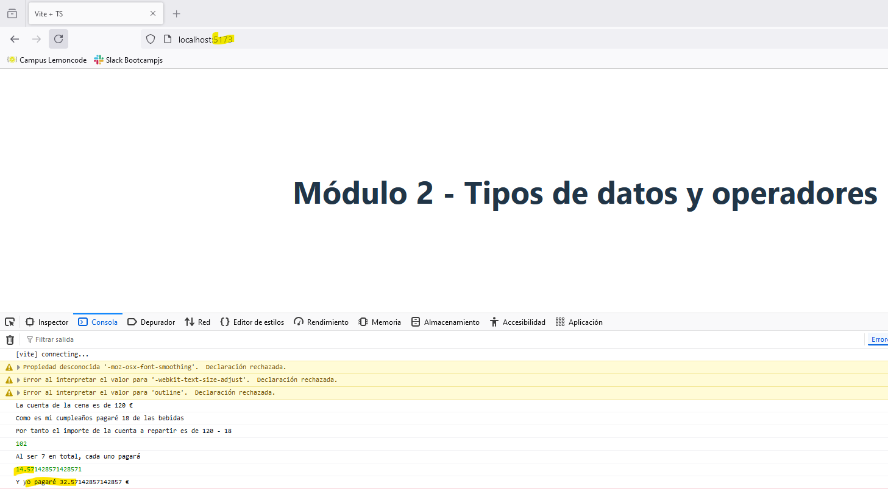

## Laboratorio Módulo 2 Tipos de datos y Operadores

## Cena de cumpleaños entre amigos

<p>Tienes un grupo de 6 amigos y quieres invitarlos a cenar por tu cumpleaños.</p>


- Solo puedes permitirte invitar a las bebidas, ya que estás un poco ajustado de dinero.

- Tienes un ticket de cena que cuesta 120 € y en el que ya se incluyen las bebidas por un valor de 18 €.

- Calcula cuánto tendría que pagar cada comensal para dividir los costos de manera equitativa.

- Utiliza JavaScript para hacer el cálculo y mostrar el resultado por consola.

## Resultado

<p>Utilizaré el <a href="https://github.com/Lemoncode/typescript-sandbox" title="sandbox de TS"> sandbox de TypeScript</a> para la resolución. </p>

<p>El código es el siguiente</p>

```JavaScript
console.log("La cuenta de la cena es de 120 €");
console.log("Como es mi cumpleaños pagaré 18 de las bebidas");
console.log("Por tanto el importe de la cuenta a repartir es de 120 - 18 ");
console.log(120 - 18);
console.log("Al ser 7 en total, cada uno pagará");
console.log((120 - 18) / 7);
console.log("Y yo pagaré " + ((120 - 18)/ 7  + 18) + " €");
```

Y por consola


